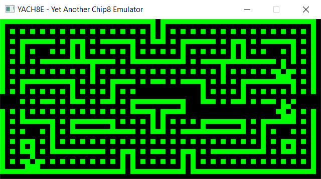
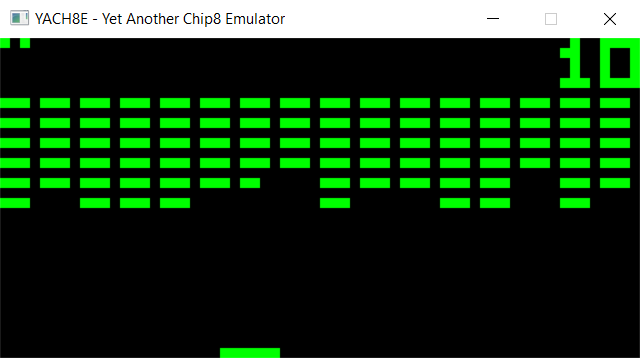

# YACH8E
YACH8E (pronounced 'yacht') - Yet Another CHip-8 Emulator.

This is a Chip-8 emulator i've developed. Graphics and audio are implemented.

## Opcodes Implementation
In the table below a list of all implemented opcodes. The list is based on [2]. Marked with '*' updated description according to the implementation that worked which differs from [1] or [2].
| Opcode | Description                                                                                                                                                                 |
---------|-----------------------------------------------------------------------------------------------------------------------------------------------------------------------------|
| 0NNN   | Execute machine language subroutine at address NNN                                                                                                                          |
| 00E0   | Clear the screen                                                                                                                                                            |
| 00EE   | Return from subroutine                                                                                                                                                      |
| 1NNN   | Jump to address NNN                                                                                                                                                         |
| 2NNN   | Execute subroutine starting at address NNN                                                                                                                                  |
|*3XNN   | Skip the following instruction if the value of register VX equals NN   Else, execute next instruction                                                                    |
|*4XNN   | Skip the following instruction if the value of register VX is not equal to NN   Else, execute next instruction                                                           |
| 5XY0   | Skip the following instruction if the value of register VX is equal to the value of register VY   Else, execute next instruction                                         |
| 6XNN   | Store number NN in register VX                                                                                                                                              |
|*7XNN   | Add the value NN to register VX   Ignore carry                                                                                                                           |
| 8XY0   | Store the value of register VY in register VX                                                                                                                               |
| 8XY1   | Set VX to VX OR VY                                                                                                                                                          |
| 8XY2   | Set VX to VX AND VY                                                                                                                                                         |
| 8XY3   | Set VX to VX XOR VY                                                                                                                                                         |
| 8XY4   | Add the value of register VY to register VX   Set VF to 01 if a carry occurs   Set VF to 00 if a carry does not occur                                                 |
| 8XY5   | Subtract the value of register VY from register VX   Set VF to 00 if a borrow occurs   Set VF to 01 if a borrow does not occur                                        |
|*8XY6   | Store the value of register VX shifted right one bit in register VX   Set register VF to the least significant bit prior to the shift                                    |
| 8XY7   | Set register VX to the value of VY minus VX   Set VF to 00 if a borrow occurs   Set VF to 01 if a borrow does not occur                                               |
|*8XYE   | Store the value of register VX shifted left one bit in register VX   Set register VF to the most significant bit prior to the shift                                      |
| 9XY0   | Skip the following instruction if the value of register VX is not equal to the value of register VY                                                                         |
| ANNN   | Store memory address NNN in register I                                                                                                                                      |
| BNNN   | Jump to address NNN + V0                                                                                                                                                    |
| CXNN   | Set VX to a random number with a mask of NN                                                                                                                                 |
| DXYN   | Draw a sprite at position VX, VY with N bytes of sprite data starting at the address stored in I   Set VF to 01 if any set pixels are changed to unset, and 00 otherwise |
|*EX9E   | Skip the following instruction if the key corresponding to the hex value currently stored in register VX is pressed, Else execute next instruction                          |
|*EXA1   | Skip the following instruction if the key corresponding to the hex value currently stored in register VX is not pressed, Else execute next instruction                      |
| FX07   | Store the current value of the delay timer in register VX                                                                                                                   |
| FX0A   | Wait for a keypress and store the result in register VX                                                                                                                     |
| FX15   | Set the delay timer to the value of register VX                                                                                                                             |
| FX18   | Set the sound timer to the value of register VX                                                                                                                             |
| FX1E   | Add the value stored in register VX to register I                                                                                                                           |
| FX29   | Set I to the memory address of the sprite data corresponding to the hexadecimal digit stored in register VX                                                                 |
| FX33   | Store the binary-coded decimal equivalent of the value stored in register VX at addresses I, I+1, and I+2                                                                   |
|*FX55   | Store the values of registers V0 to VX inclusive in memory starting at address I                                                                                            |
|*FX65   | Fill registers V0 to VX inclusive with the values stored in memory starting at address I                                                                                    |

## References
[1] http://devernay.free.fr/hacks/chip8/C8TECH10.HTM

[2] http://mattmik.com/files/chip8/mastering/chip8.html

[3] https://github.com/qxxxb/sdl2-beeper